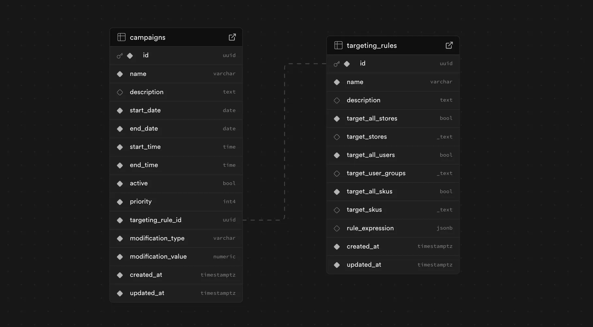
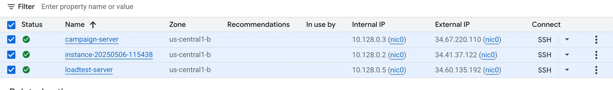
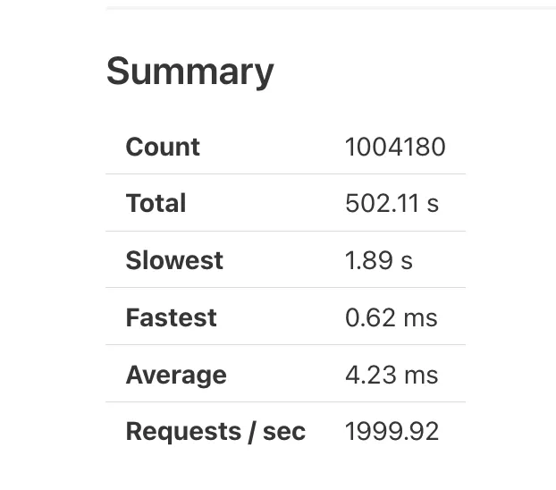
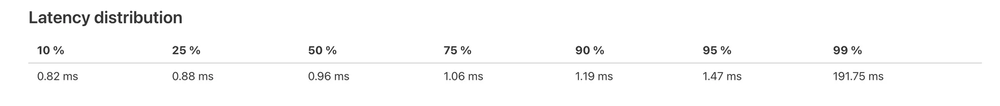
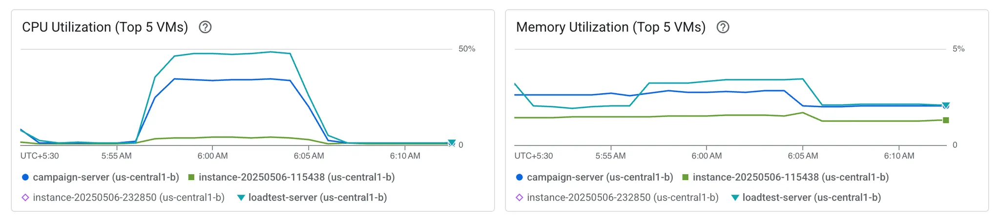

# campaign-manager

## DB Schema



## Query to fetch campaigns with targeting rules

```
SELECT
    c.id AS campaign_id,
    c.name AS campaign_name,
    c.active AS campaign_active,
    c.priority AS campaign_priority,
    c.modification_type AS modification_type,
    c.modification_value AS modification_value,

    tr.id AS rule_id,
    tr.name AS rule_name,
    tr.target_all_skus,
    tr.target_skus,
    tr.rule_expression
FROM
    campaigns c
JOIN
    targeting_rules tr ON c.targeting_rule_id = tr.id
WHERE
    c.active = TRUE
    AND $3::date >= c.start_date
    AND $3::date <= c.end_date
    
    AND (
        (c.start_time < c.end_time AND $4::time BETWEEN c.start_time AND c.end_time)
        OR
        (c.start_time > c.end_time AND ($4::time >= c.start_time OR $4::time <= c.end_time))
    )

    AND (tr.target_all_stores = TRUE OR tr.target_stores IS NULL OR tr.target_stores = '{}' OR tr.target_stores && ARRAY[$1]) -- $1 = storeID

    AND (tr.target_all_users = TRUE OR tr.target_user_groups IS NULL OR tr.target_user_groups = '{}' OR tr.target_user_groups && $2) -- $2 = userGroups

ORDER BY
    c.priority ASC;
```

## Added below Index for performance

```
CREATE INDEX idx_targeting_rules_target_stores_gin ON targeting_rules USING GIN (target_stores) WHERE target_all_stores = FALSE AND target_stores IS NOT NULL;
CREATE INDEX idx_targeting_rules_target_user_groups_gin ON targeting_rules USING GIN (target_user_groups) WHERE target_all_users = FALSE AND target_user_groups IS NOT NULL;
CREATE INDEX idx_targeting_rules_target_skus_gin ON targeting_rules USING GIN (target_skus) WHERE target_all_skus = FALSE AND target_skus IS NOT NULL;


CREATE INDEX idx_campaigns_active_dates ON public.campaigns (active, start_date, end_date);
ALTER TABLE public.campaigns SET (autovacuum_vacuum_scale_factor=0.05);
```


## Loadtest

Ran loadtest for ~8mins on following data sets to simulate production high load.

1. 100 active campaigns for each store. Above query will return 100 active campaigns each time a api is called with particular store_id.
2. Each req contains 50 to 100 sku’s id.
3. total 50k rows in campaign table.
4. 2000 RPS load ~ 120k rpm.

Setup

created 3 VM’s on GCP for loadtest at `us-central1-b` location

VM1 (database )

- Name: instance-20250506-115438
- **Machine type:** n2-standard-8 (4 CPUs, 32 GB Memory)

VM2 (campaign server)

- Name: campaign-server
- **Machine type:** n2-standard-4 (2 CPUs, 16 GB Memory)

VM3 (loadtest server)

- Name: loadtest-server
- Machine type: n2-standard-4 (2 CPUs, 16 GB Memory)





### Loadtest Summary

p99 is 191.75ms while p95 is 1.47ms at 120k rpm





## Observability (At 120k rpm )

